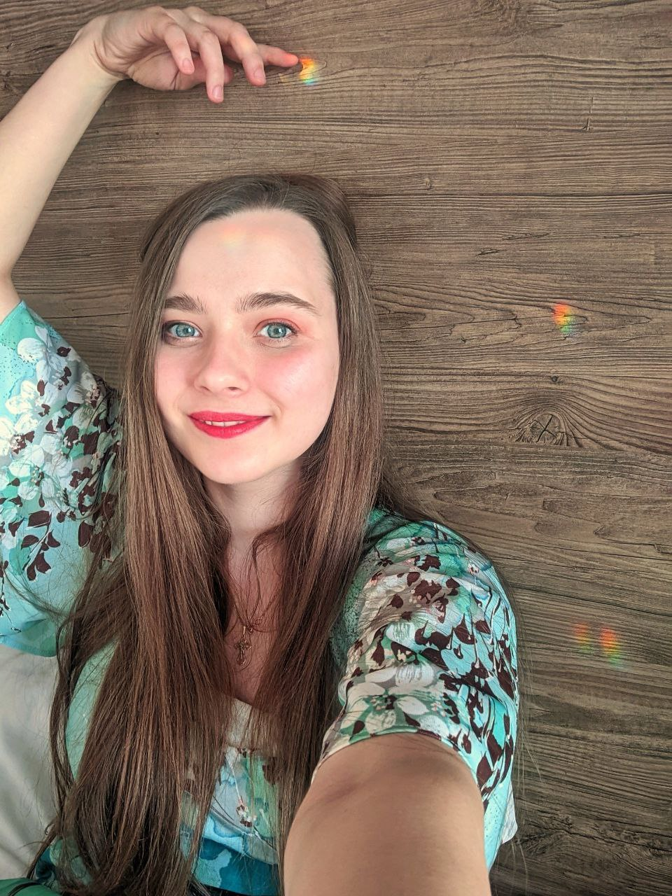

# Vitalia Tereschenko

## frontend-developer



### Contacts

* Phone: +998909420190
* Email: [vitaliatereschenko](vitaliatereschenko@gmail.com)
* Github: [programissis](https://github.com/programissis)

### Skills

* HTML
* CSS
* JS
* Git

### Code examples

```javascript
const myHeading = document.querySelector('h1');

function sum(num1, num2) {
    const result = num1 + num2;
    return result;
}

myHeading.textContent = sum(2, 2);
```

### Experience before programming

* Jun 2019 - Jul 2019 Preschool-educator State educational institution
“Nursery-kindergarten №332 of the city Minsk”
* Jun 2019 - Jul 2019 Kindergarten preparation teacher
“Mamasuper Early Learning School”
* Apr 2020 - Apr 2022 Preschool-educator State educational institution
“Nursery-kindergarten №39 of the city Minsk”
* May 2022 - 2023 and now
Babysitter, nanny
Working in families

### Experience after programming

Now I am self-taught and taking courses

### Education

* Minsk College of Business (diploma)
* Belarusian State University named after Maksim Tank (unfinished)
* Rolling Scopes School

### Languages

* English: B1
* Russian: native
* Belarusian: native

### About me

_Hi, my name is Vitalia and I am an aspiring frontend developer. I would like to become a software engineer at EPAM. I know that there are opportunities and a good career path waiting for me here. It inspires and motivates me to develop myself.
During my studies at the Minsk College of Business I took two courses in information technology. In these classes we made web applications with games for children and many other things. My teaching experience is more than 5 years and it seems to me that thanks to this work I have improved my soft skills. Besides, I am an active volunteer for the Rolling Scopes Uzbekistan community. I give talks and organize meetups, hangouts and friendly breakfasts for students, find new and interesting speakers, work on the development of the community, help run the chat in Telegram, and plan to continue doing all of the above after my employment at EPAM. I think that what RS School is doing is very important and I want to be a part of it.
I believe that my experience will have a good impact on my future work and I would like to start right after the course._
